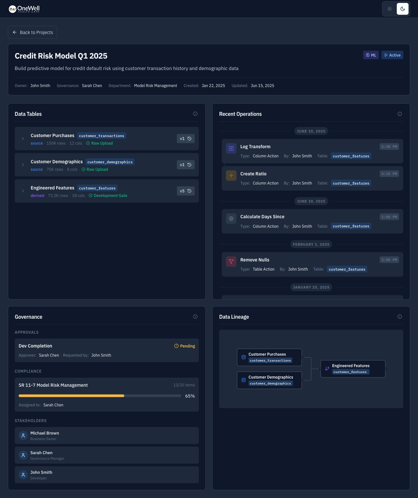
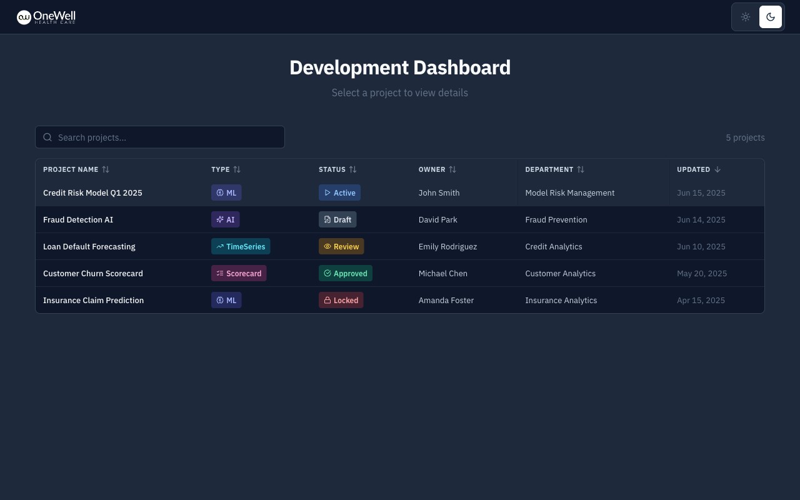
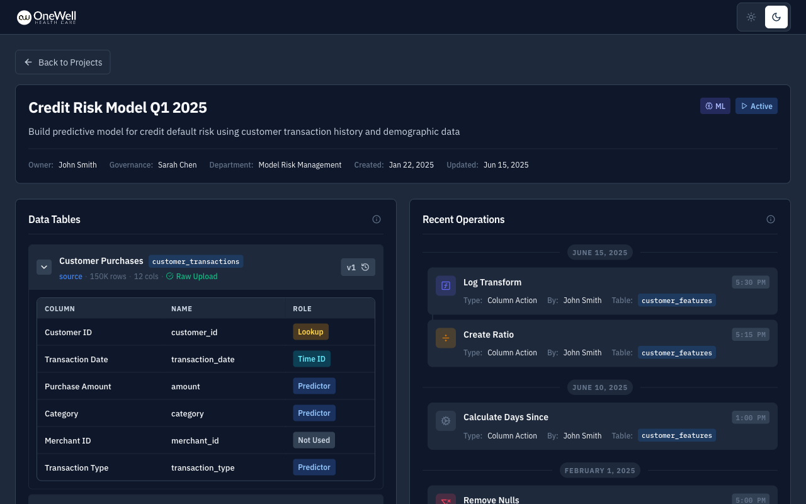
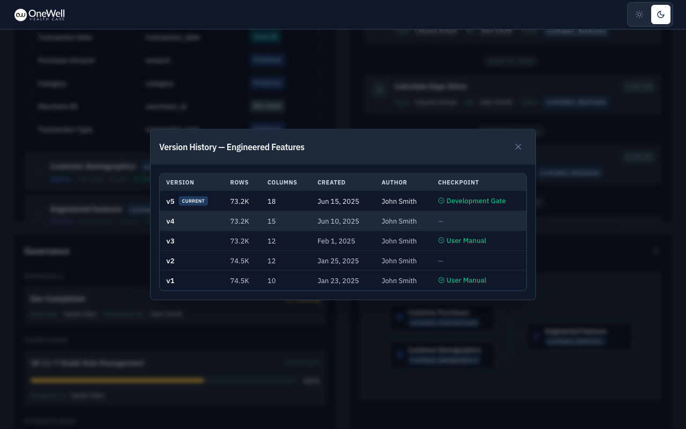
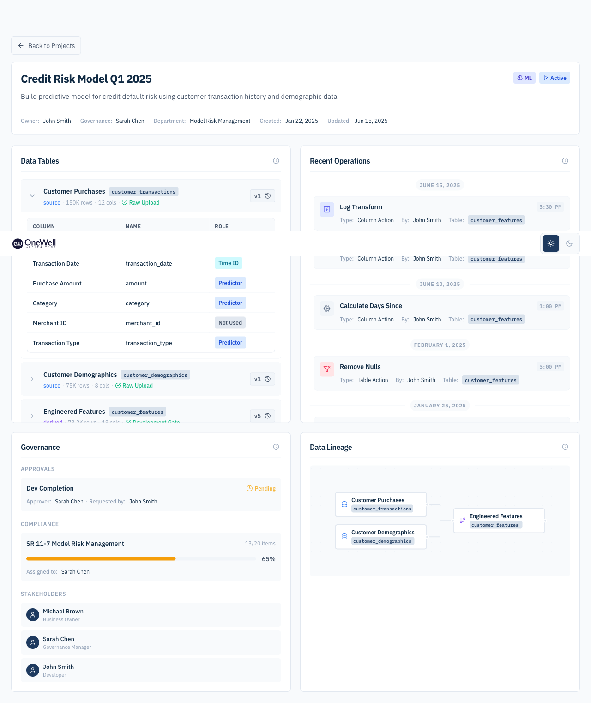
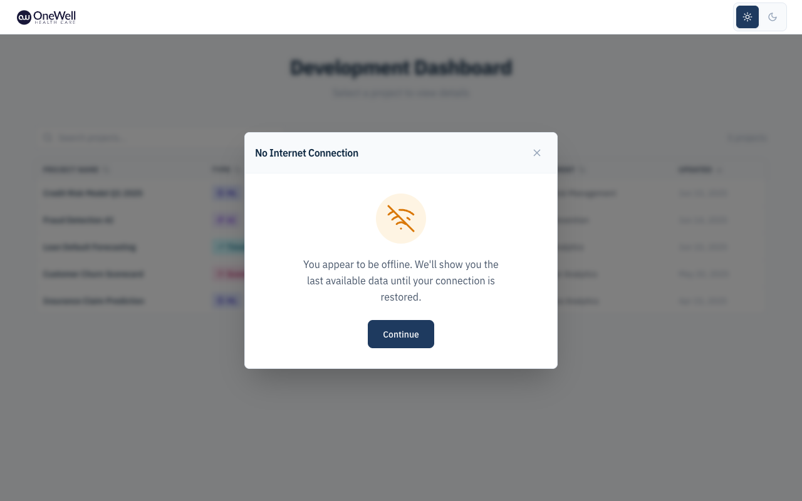

# OneWell Model Development Dashboard

A modern, feature-rich dashboard for data scientists working in regulated industries (banking, insurance, healthcare). Built as a case study demonstrating React + TypeScript best practices.



## ✨ Features

### Core Requirements

- **Project Header** — Name, type badge, status indicator, owner, governance manager, timestamps, department
- **Data Tables Summary** — Tables with version info, row/column counts, checkpoint indicators, expandable column details with color-coded roles, version history modal
- **Operations Timeline** — Last 10 operations grouped by date with operation details
- **Governance Panel** — Pending approvals, compliance progress with visual bar, stakeholder list
- **Data Lineage** — Interactive visualization with upstream dependency highlighting

### Beyond Requirements

- 🌓 **Dark/Light Theme** — System preference detection with manual toggle
- 📴 **Offline Support** — Cached data with graceful fallbacks
- 🔍 **Search & Sort** — Filter and sort projects in the selector
- ✨ **Smooth Animations** — Framer Motion transitions
- ⚡ **Optimized Performance** — React Compiler for automatic memoization, granular state selectors
- ♿ **Accessibility** — ARIA labels, semantic HTML, keyboard navigation
- 📱 **Responsive Design** — Grid-based adaptive layout

## 🛠 Tech Stack

| Category              | Technology                        |
| --------------------- | --------------------------------- |
| Framework             | React 19                          |
| Language              | TypeScript (strict mode)          |
| Build Tool            | Vite 6                            |
| Compiler              | React Compiler (auto-memoization) |
| Routing               | React Router v7                   |
| State Management      | Zustand with persist middleware   |
| Styling               | Modular SCSS with CSS variables   |
| Animations            | Framer Motion                     |
| Lineage Visualization | ReactFlow (@xyflow/react)         |
| Icons                 | Lucide React                      |
| Date Handling         | date-fns                          |
| Fonts                 | IBM Plex Sans + IBM Plex Mono     |

## 🚀 Getting Started

### Prerequisites

- Node.js 18+
- npm 9+

### Installation

```bash
# Clone the repository
git clone https://github.com/yourusername/onewell-case-study.git
cd onewell-case-study

# Install dependencies
npm install

# Start development server
npm run dev
```

The app will be available at `http://localhost:5173`

### Available Scripts

```bash
npm run dev          # Start development server
npm run build        # Build for production
npm run preview      # Preview production build
npm run lint         # Run ESLint
npm run format       # Format code with Prettier
npm run test         # Run unit tests (Vitest)
npm run cypress      # Open Cypress for E2E tests
```

## 📁 Project Structure

```
src/
├── components/           # React components
│   ├── Badge/           # Reusable badge component
│   ├── DataTable/       # Generic sortable/searchable table
│   ├── ErrorBoundary/   # Error handling wrapper
│   ├── Panel/           # Reusable panel container
│   ├── ProjectDashboard/
│   │   ├── DataLineage/      # ReactFlow lineage visualization
│   │   ├── DataTables/       # Tables with column list & versions
│   │   ├── Governance/       # Approvals, compliance, stakeholders
│   │   ├── OperationsTimeline/
│   │   └── ProjectHeader/
│   └── ProjectSelector/ # Project list with search/sort
├── constants/           # Configuration constants
├── data/               # Mock data (data.json)
├── hooks/              # Custom React hooks
├── services/           # API layer with simulated delays
├── store/              # Zustand stores
├── styles/             # Global SCSS (variables, themes, mixins)
├── types/              # TypeScript type definitions
└── utils/              # Utility functions
```

## 🎨 Design Decisions

### State Management Strategy

**Global Store (Zustand)** is used for:

- Theme preference (persisted)
- Dashboard data (project, tables, operations, governance, lineage)
- Data caching for offline support

**Local State (useState)** is used for:

- Expanded/collapsed table rows
- Modal open/close states
- Search input values

This separation prevents unnecessary re-renders and keeps the codebase maintainable.

### API Layer Architecture

```
┌─────────────┐     ┌─────────────┐     ┌─────────────┐
│   api.ts    │ ──▶ │ repository  │ ──▶ │  data.json  │
│  (delays,   │     │   .ts       │     │  (mock)     │
│   errors,   │     │ (pure data) │     │             │
│   dedup)    │     │             │     │             │
└─────────────┘     └─────────────┘     └─────────────┘
```

- **api.ts** — Simulates network behavior (300-800ms delays, optional error simulation)
- **repository.ts** — Pure data access layer
- **Request deduplication** — Prevents redundant API calls

### Performance Optimizations

1. **React Compiler** — Automatic memoization at build time (no manual `memo()`, `useMemo`, or `useCallback` wrappers needed)
2. **Granular Selectors** — Each panel subscribes only to its specific data slice
3. **Parallel Fetching** — Dashboard data loaded with `Promise.allSettled`
4. **Skeleton Loading** — Layout-matched skeletons prevent content shift

#### React Compiler

This project uses [React Compiler](https://react.dev/learn/react-compiler) (introduced in React 19) for automatic performance optimization. The compiler analyzes component data flow and applies memoization at build time, eliminating the need for manual optimization.

**What it handles automatically:**

- Component re-render skipping (equivalent to `React.memo()`)
- Computed value caching (equivalent to `useMemo()`)
- Callback stability (equivalent to `useCallback()`)

**Configuration:**

```typescript
// vite.config.ts
react({
  babel: {
    plugins: [["babel-plugin-react-compiler", {}]],
  },
});
```

This results in cleaner code without optimization boilerplate while achieving equal or better performance than manual memoization.

### Theme System

CSS variables enable seamless theme switching:

```scss
:root {
  --color-bg-primary: #ffffff;
  --color-text-primary: #0f172a;
}

[data-theme="dark"] {
  --color-bg-primary: #0f172a;
  --color-text-primary: #f8fafc;
}
```

## 📊 Mock Data

The app uses realistic mock data representing 5 projects:

| Project                    | Type       | Status   |
| -------------------------- | ---------- | -------- |
| Credit Risk Model Q1 2025  | ML         | Active   |
| Loan Default Forecasting   | TimeSeries | Review   |
| Customer Churn Scorecard   | Scorecard  | Approved |
| Fraud Detection AI         | AI         | Draft    |
| Insurance Claim Prediction | ML         | Locked   |

Each project includes:

- Multiple tables with version history (up to 5 versions)
- Various checkpoint types (raw_upload, user_manual, development_gate, etc.)
- Different governance states
- Rich operation history

## 🖼 Screenshots

### Project Selector (Dark Theme)



### Dashboard with Expanded Table



### Version History Modal



### Light Theme



### Offline Support Modal



## 🔮 Future Improvements

- [ ] **Unit Tests** — Vitest with React Testing Library
- [ ] **E2E Tests** — Cypress test suites
- [ ] **Panel Error States** — Individual error displays per section
- [ ] **Table Filtering** — Filter tables by type/checkpoint
- [ ] **Operation Details Modal** — Expandable operation parameters
- [ ] **Lineage Full View** — Dedicated page with zoom/pan
- [ ] **PWA Support** — Service worker for true offline capability

## 📝 Assumptions

1. **No Authentication** — Dashboard assumes user is already authenticated
2. **Read-Only** — No create/update/delete operations implemented
3. **Single Project View** — One project visible at a time
4. **Mock Data Only** — No real backend integration

## 🙏 Acknowledgments

- Design inspired by OneWell Health Care branding
- Icons from [Lucide](https://lucide.dev/)
- Lineage visualization powered by [ReactFlow](https://reactflow.dev/)

---

Built with ❤️ for the OneWell Frontend Case Study
